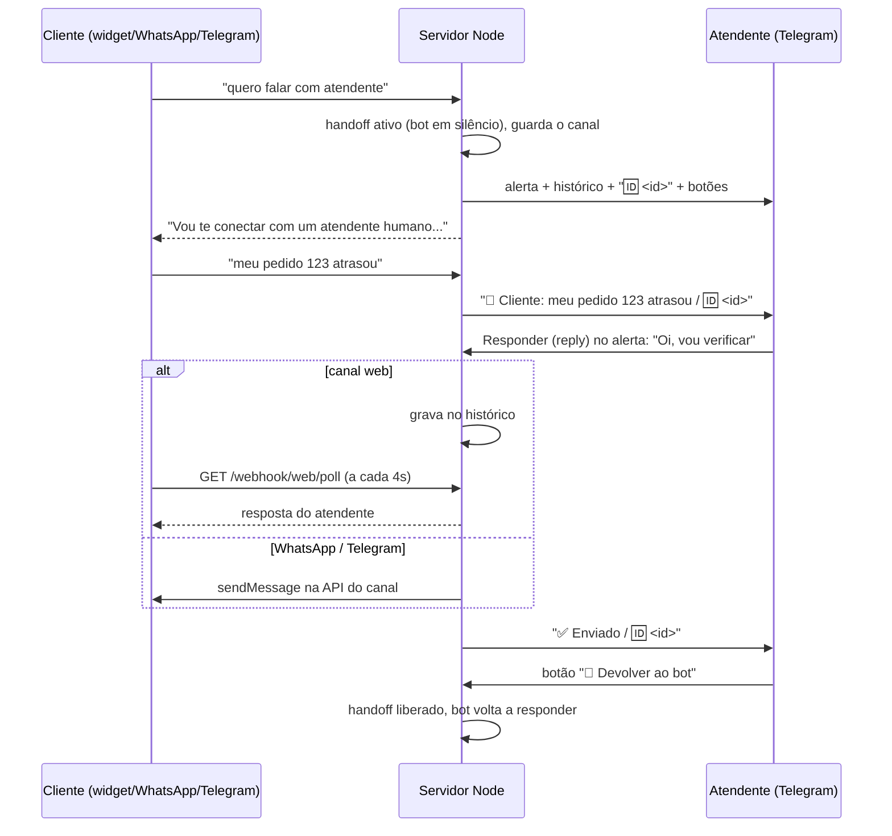

# Relay de handoff — atendente humano responde pelo Telegram

Como o atendente humano assume uma conversa depois de um handoff e fala com
o cliente **no mesmo canal em que ele já estava**: widget do site, WhatsApp
ou Telegram. O cliente não percebe troca de canal. O atendente usa só o
Telegram, respondendo direto no alerta ou pelo Mini App.

Esta é a "Opção B" do item #5 de [`SECURITY_REVIEW.md`](SECURITY_REVIEW.md),
adiada na revisão de 04/10/2026 e construída em 05/10/2026.

Última atualização: 05/10/2026.

---

## 1. Por que Telegram para o atendente

Opções avaliadas (Discord, WhatsApp, Telegram) pelos três eixos do
`CLAUDE.md`:

| | Telegram (escolhido) | WhatsApp | Discord |
|---|---|---|---|
| Overhead na VM | zero: reaproveita o bot e o webhook que já existem | zero | bot com gateway = websocket aberto + dezenas de MB; Interactions por HTTP = zero |
| Custo | grátis | **template pago** por alerta (mensagem iniciada pela empresa fora da janela de 24h) | grátis |
| Autenticação | allowlist de chat id + Mini App com `initData` assinado | só token em link | assinatura Ed25519 das Interactions |
| Pronto hoje | sim (bot `@rizzatotech_atendimento_bot` no ar) | não (falta o chip `+55`) | exigiria criar um App novo |

---

## 2. Fluxo



---

### O que dispara um handoff

| Gatilho | Motivo no alerta | Onde |
|---|---|---|
| Palavra-chave do cliente (`handoffKeywords`, `frustrationKeywords`) | pedido de atendimento humano / frustração | `detectHandoffTrigger()`, antes do LLM |
| Pergunta de pedido sem `AgentService`, cancelamento, capacidade sem conector | pedido de atendimento humano | `orchestrator.ts` |
| **O LLM decide** (ex.: o cliente **aceitou** a transferência oferecida: "sim, pode") | o assistente transferiu | o LLM responde `[[TRANSFERIR]]`; `detectAssistantHandoff()` |

O terceiro gatilho existe desde 06/10/2026. Antes, o prompt mandava o LLM
transferir, mas ele não tinha como: escrevia "vou te transferir" e **nada
acontecia** (bug real em produção, o cliente esperando um atendente que nunca
foi avisado). Há também uma rede de segurança: se o LLM **afirmar** que está
transferindo sem o sinal ("vou te transferir", "estou conectando você"), o
handoff é executado mesmo assim e o servidor loga um aviso. Ofertas
("posso transferir?") não disparam.

## 3. Guia do atendente

**Receber:** quando um handoff dispara, chega no seu chat com o bot:

```
🔔 Handoff — cliente no widget do site
Motivo: pedido de atendimento humano (ou assunto que exige um)

Últimas mensagens:
👤 Cliente: quero falar com atendente

↩️ Responda (reply) a esta mensagem pra falar com o cliente.
🆔 7f0c2c1e-...
[💬 Abrir conversa]
[🤖 Devolver ao bot]
```

**Responder (caminho principal):** toque e segure (ou deslize) a mensagem e
escolha **Responder**. O texto vai pro cliente. Funciona em **qualquer**
mensagem do bot que termine com `🆔`: o alerta, cada mensagem nova do
cliente e a própria confirmação "✅ Enviado". Mensagem enviada sem usar
Responder recebe um texto de ajuda e **não** vai pra ninguém.

**Ver a conversa inteira:** botão **💬 Abrir conversa** abre o Mini App
dentro do Telegram, com o histórico completo, uma caixa de resposta e o
botão de devolver ao bot. Ele se atualiza a cada 4s.

**Encerrar o atendimento:** botão **✅ Encerrar atendimento** (no alerta e no
Mini App), ou `/encerrar` como resposta a uma mensagem com 🆔. O cliente
recebe *"Atendimento encerrado. Obrigado pelo contato! Se precisar de mais
alguma coisa, é só mandar uma nova mensagem."* e o bot volta a responder.

**Devolver ao bot sem encerrar:** botão **🤖 Devolver ao bot**, ou `/liberar`.
Nenhum aviso vai pro cliente. Serve pra quando você resolveu a sua parte e o
bot pode continuar a conversa.

**Comandos:**

| Comando | Quem pode usar | Efeito |
|---|---|---|
| `/meuid` | qualquer pessoa | o bot responde o seu chat id (é assim que se descobre o valor pra `HANDOFF_TELEGRAM_CHAT_IDS`) |
| `/encerrar` (como reply) | atendente | encerra o atendimento, avisa o cliente, devolve ao bot |
| `/liberar` (como reply) | atendente | devolve aquela conversa ao bot sem avisar o cliente |

**Regras de tempo** (dois timers diferentes):

| Timer | Mede | O que acontece | Config |
|---|---|---|---|
| Inatividade | nenhuma mensagem **de nenhum lado** | atendimento **encerrado**: o cliente recebe *"Encerramos este atendimento por falta de interação..."*, você recebe "🔚 Atendimento encerrado por inatividade" e o bot volta | `handoffInactivityMinutes`, padrão 30 (0 desliga) |
| Atendente ausente | nenhuma resposta **do atendente** (o cliente pode estar falando) | o bot volta a responder em silêncio, sem aviso | `handoffTimeoutHours`, padrão 4h |

- A inatividade é checada por uma varredura a cada minuto
  (`setInterval` em `src/server.ts`), porque inatividade é justamente a
  ausência de mensagens que disparariam uma checagem.
- Cada resposta sua renova os dois prazos. Cada mensagem do cliente renova
  só o de inatividade.
- Se você responder uma conversa que já tinha sido devolvida ao bot ou
  expirado, ela **volta pra você** (o bot fica em silêncio de novo) e a
  confirmação avisa isso.

---

## 4. Configuração

### `.env`

| Variável | Obrigatória | Para quê |
|---|---|---|
| `TELEGRAM_BOT_TOKEN` | sim | bot de **clientes** (canal Telegram). Também é o do atendente se não houver `HANDOFF_TELEGRAM_BOT_TOKEN` |
| `HANDOFF_TELEGRAM_BOT_TOKEN` | não | bot **do atendente**, separado (seção 4.1). Recebe os alertas e as respostas, em `/webhook/telegram-desk` |
| `HANDOFF_TELEGRAM_CHAT_IDS` | sim | chat ids dos atendentes, separados por vírgula: quem recebe alerta e quem pode responder |
| `TELEGRAM_WEBHOOK_SECRET` | sim | **o boot falha sem ele** quando há atendentes configurados (ver seção 6) |
| `HANDOFF_TELEGRAM_WEBHOOK_SECRET` | não | segredo do webhook do bot do atendente; sem ele, vale o `TELEGRAM_WEBHOOK_SECRET` |
| `PUBLIC_BASE_URL` | não | URL https pública (ex.: `https://rizzato-tech.rizzatotech.com`). Sem ela o alerta sai sem o botão "Abrir conversa" |

`HANDOFF_TELEGRAM_CHAT_IDS` e `PUBLIC_BASE_URL` **não** estão na lista de
segredos do Key Vault (`SECRET_ENV_VARS` em `src/config.ts`): não são
segredo e vêm do `.env` da VM.

### `agent.config.json`

`"handoffNotifier": "telegram"`, ou a opção **"Telegram (avisar e responder
pelo bot)"** na tela de configuração. O save é recusado se faltar
`TELEGRAM_BOT_TOKEN` ou `HANDOFF_TELEGRAM_CHAT_IDS`.

### Telegram

- Se o `setWebhook` foi registrado com `allowed_updates=["message"]`, os
  cliques em botão (`callback_query`) não chegam e "Devolver ao bot" não
  funciona. Registre de novo **sem** `allowed_updates` (o padrão do
  Telegram já inclui `callback_query`).
- O botão do Mini App não precisa de configuração no BotFather: botões
  `web_app` em teclado inline aceitam qualquer URL https.

### Passo a passo do deploy

1. Mande `/meuid` pro bot e anote o número.
2. No `.env` da VM: `HANDOFF_TELEGRAM_CHAT_IDS=<número>` e
   `PUBLIC_BASE_URL=https://rizzato-tech.rizzatotech.com`.
3. Confirme que `telegram-webhook-secret` existe no Key Vault
   (`kv-agente-atendimento`). Ele já existe desde o go-live do Telegram,
   mas a lição do incidente de 04/10/2026 (`STATUS.md`) vale: secret exigido
   por uma checagem nova precisa existir **antes** do deploy.
4. `pm2 restart` e confira no log: `Handoff relay: 1 atendente(s) no Telegram.`
5. Tela de configuração: notificação de handoff = Telegram.
6. Deploy do widget atualizado no `rizzatotech-site`.
7. Teste: no site, "quero falar com atendente" → alerta chega → Responder →
   a resposta aparece no widget com o rótulo "Atendente".

### 4.1 Dois bots: um pra clientes, outro pro atendente (06/10/2026)

**Problema:** com um bot só, quem está em `HANDOFF_TELEGRAM_CHAT_IDS` cai
sempre no balcão do atendente. Você nunca conseguia usar o bot como cliente,
e o bot deixou de servir pra simular o atendimento automático.

**Solução:** dois bots no mesmo servidor, sem processo nem custo a mais.

| Bot | Variável | Webhook | Papel |
|---|---|---|---|
| **Bot de clientes** (novo; simula o atendimento que será pelo WhatsApp) | `TELEGRAM_BOT_TOKEN` | `/webhook/telegram` | atende com o LLM e transfere pro humano quando precisa. **Todo mundo é cliente aqui, inclusive você** |
| **Bot do atendente** (o atual, `@rizzatotech_atendimento_bot`) | `HANDOFF_TELEGRAM_BOT_TOKEN` | `/webhook/telegram-desk` | recebe os alertas, Responder, botões, Mini App. Quem não é atendente recebe "uso interno" |

Sem `HANDOFF_TELEGRAM_BOT_TOKEN` tudo funciona como antes (um bot só). Por
isso o código pode ir pro ar antes da migração.

#### Migração em produção (passo a passo)

O token **atual** passa a ser o do atendente, e o bot **novo** fica com o canal
de clientes. Faça os passos na ordem, de uma vez: entre os passos 3 e 4 o bot
antigo ainda aponta pro webhook de clientes.

1. **Publicar o código** (push), sem mudar nada na VM. O comportamento
   continua igual.
2. **Criar o bot de clientes** no [@BotFather](https://t.me/BotFather):
   `/newbot`, nome ex. `Rizzato Tech`, username ex. `rizzatotech_bot`. Guarde
   o token.
3. **Key Vault** (no seu terminal, com `az login`). A VM já consegue ler os
   nomes novos: a identidade dela tem "Key Vault Secrets User" no cofre
   inteiro (conferido em 06/10). `HANDOFF_TELEGRAM_BOT_TOKEN` e
   `HANDOFF_TELEGRAM_WEBHOOK_SECRET` estão em `SECRET_ENV_VARS`. **Primeiro**
   copie o token atual para o nome novo, **depois** troque o de clientes:
   ```bash
   KV=kv-agente-atendimento
   az keyvault secret set --vault-name $KV -n handoff-telegram-bot-token \
     --value "$(az keyvault secret show --vault-name $KV -n telegram-bot-token --query value -o tsv)"
   az keyvault secret set --vault-name $KV -n telegram-bot-token --value "<TOKEN DO BOT NOVO>"
   ```
4. **Webhooks dos dois bots**, puxando os valores do Key Vault (nenhum token
   precisa ser colado no chat nem aparece na tela):
   ```bash
   DESK=$(az keyvault secret show --vault-name $KV -n handoff-telegram-bot-token --query value -o tsv)
   CUST=$(az keyvault secret show --vault-name $KV -n telegram-bot-token --query value -o tsv)
   SEC=$(az keyvault secret show --vault-name $KV -n telegram-webhook-secret --query value -o tsv)
   URL=https://rizzato-tech.rizzatotech.com

   # confira os donos ANTES (atendente = rizzatotech_atendimento_bot; clientes = o novo)
   curl -s "https://api.telegram.org/bot$DESK/getMe"; echo
   curl -s "https://api.telegram.org/bot$CUST/getMe"; echo

   curl -s "https://api.telegram.org/bot$DESK/setWebhook" -d "url=$URL/webhook/telegram-desk" -d "secret_token=$SEC"; echo
   curl -s "https://api.telegram.org/bot$CUST/setWebhook" -d "url=$URL/webhook/telegram" -d "secret_token=$SEC"; echo
   ```
5. **Reiniciar o agente** pra ele ler os segredos novos do Key Vault:
   ```bash
   ssh azureuser@20.127.12.103 'pm2 restart agente-atendimento --update-env && sleep 3 && tail -5 ~/.pm2/logs/agente-atendimento-out.log'
   ```
   O log deve mostrar `Handoff relay: 1 atendente(s) no Telegram (bot próprio, /webhook/telegram-desk).`
6. **Testar:** do seu Telegram, abra o **bot novo**, mande "quero falar com
   atendente". O alerta chega no **bot antigo** (o do atendente). Dê Responder:
   a resposta aparece no bot novo, como se fosse o atendimento ao cliente.

**Se algo der errado:** volte o segredo `telegram-bot-token` pro token antigo
(está guardado em `handoff-telegram-bot-token`), apague
`handoff-telegram-bot-token`, refaça o `setWebhook` do bot antigo apontando pra
`/webhook/telegram` e reinicie. Volta a ser um bot só.

### 4.2 Idioma do cliente (06/10/2026)

O bot responde no idioma do cliente: o widget manda o idioma da página do site
(pt/en/it), o Telegram manda o idioma do app (`language_code`). Sem idioma
informado (WhatsApp), o LLM responde no idioma em que o cliente escreveu. As
mensagens fixas ("Vou te conectar...", "Atendimento encerrado...") estão em
pt/en/it em `src/orchestrator/messages.ts`.

**O relay não traduz:** quando o cliente não fala português, o alerta mostra
`🌐 Idioma do cliente: inglês — responda em inglês`. O que você escrever chega
ao cliente exatamente como escreveu.

---

## 5. Componentes

| Arquivo | Papel |
|---|---|
| `src/handoffNotifier/telegramNotifier.ts` | manda o alerta e repassa cada mensagem nova do cliente (`onCustomerMessage`) pros atendentes |
| `src/handoff/telegramDesk.ts` | recebe reply, `/liberar` e o clique em "Devolver ao bot" vindos do chat de um atendente |
| `src/handoff/relay.ts` | `HumanRelay`: entrega o texto do atendente no canal certo e devolve ao bot. Não depende de interface |
| `src/handoff/attendants.ts` | allowlist de atendentes e o marcador `🆔` (formatar, extrair, neutralizar em texto citado) |
| `src/handoff/telegramInitData.ts` | valida o HMAC do `initData` do Mini App |
| `src/channels/telegramApi.ts` | `callTelegram()`: cliente único da Bot API (timeout de 10s, nunca lança) |
| `public/handoff-app.html` | o Mini App |
| `src/orchestrator/handoffState.ts` | o estado agora guarda o `channel` da conversa; `release()` o preserva |
| `src/orchestrator/orchestrator.ts` | repassa o canal ao notifier, aciona `onCustomerMessage` no PASSO 0 e expõe os métodos usados pelo relay |
| `src/server.ts` | liga relay e desk, além das rotas abaixo |

**Rotas novas:**

| Rota | Autenticação | Para quê |
|---|---|---|
| `GET /webhook/web/poll?sessionId=&after=` | nenhuma (o `sessionId` é a chave) + CORS do widget | o widget busca as respostas do atendente |
| `GET /webhook/web/health` | nenhuma + CORS do widget | status Online/Offline do widget (antes não existia, por isso ele mostrava "Offline" sempre) |
| `GET /api/handoff/:id` | `X-Telegram-Init-Data` | histórico + estado pro Mini App |
| `POST /api/handoff/:id/reply` | idem | resposta pelo Mini App |
| `POST /api/handoff/:id/release` | idem | devolver ao bot pelo Mini App |
| `POST /api/handoff/:id/close` | idem | encerrar atendimento pelo Mini App |

**Encerramento** (`HumanRelay.close()`): entrega o aviso ao cliente, devolve
ao bot e avisa os atendentes (só por inatividade; quando é você quem encerra,
a confirmação já vem do desk ou do Mini App). O atendimento é encerrado
**mesmo se o aviso não chegar** (ex.: janela de 24h do WhatsApp). A
confirmação diz quando isso acontece. No widget, o aviso chega pelo polling
como um turno `assistant` com `relayed: true`, sem o rótulo "Atendente".

**Papel novo no histórico:** `ConversationTurn.role = "human-agent"`. Separado
de `"assistant"` pra auditoria saber o que foi escrito por uma pessoa e o
que o bot gerou. Pro LLM, quando o bot volta, vira `"assistant"`: ele
precisa saber o que o atendente já disse pra não se contradizer.

**Polling do widget:** o canal web é request/response, então o servidor não
tem como empurrar mensagem. O widget pergunta a cada 4s **só enquanto
`handoffActive` for true**: fora de handoff são zero requisições extras. Foi
escolhido polling em vez de SSE/WebSocket porque, na B1s (892MB), uma conexão
aberta por visitante custa memória o tempo todo. O cursor é o índice no
histórico, que é append-only, então nunca pula nem repete mensagem.

---

## 6. Segurança

| Risco | Controle |
|---|---|
| Alguém forja um update "do atendente" no webhook e manda mensagem pros clientes em nome da empresa | `TELEGRAM_WEBHOOK_SECRET` obrigatório quando há atendentes (o boot falha sem ele) + allowlist de chat id |
| Cliente digita `🆔 <id de outra conversa>` pra desviar a resposta do atendente | texto citado tem o 🆔 trocado por `[id]`; vale só a **última** ocorrência; o marcador só é aceito em mensagem escrita pelo **bot** (`reply_to_message.from.is_bot`) |
| Link do Mini App vazado ou encaminhado | não há token no link: a autenticação é o `initData` que o Telegram assina com o token do bot, conferido contra a allowlist pelo `user.id`. Fora do Telegram, ou no Telegram de outra pessoa, a API recusa |
| `initData` capturado e reaproveitado | idade máxima de 24h (`auth_date`); comparação em tempo constante |
| `initData` em log | vai em header (`X-Telegram-Init-Data`), não na URL, então não aparece no access log do Nginx |
| Ler as respostas do atendente de outro visitante pelo polling | `sessionId` virou `crypto.randomUUID()` (era `Date.now()` + `Math.random`); o polling devolve **só** as falas `human-agent`, nunca o histórico |
| Polling com ids inventados enchendo a memória | `ConversationStore.exists()`: id desconhecido não entra no cache; ids com mais de 128 caracteres são recusados |
| XSS no widget pelo texto do bot ou do atendente | `formatMessage()` agora escapa HTML antes de aplicar o markdown (antes ia cru pro `innerHTML`); o Mini App usa só `textContent` |
| Resposta "enviada" que nunca chegou | o relay envia primeiro e só grava no histórico se a plataforma aceitou; se falhar, o atendente recebe "⚠️ Não enviado" |

---

## 7. Limitações conhecidas

- **Quem está na allowlist não consegue testar o bot como cliente** pelo
  mesmo chat do Telegram: tudo que esse chat manda vai pro balcão do
  atendente. Para testar como cliente, use outra conta ou o widget.
- **WhatsApp, janela de 24h:** a Cloud API só aceita mensagem livre até 24h
  depois da última mensagem do cliente. Fora disso a entrega falha e o
  atendente é avisado.
- **Widget:** depois de um reload, as mensagens antigas do visitante não
  reaparecem (o widget nunca guardou histórico local). As respostas do
  atendente reaparecem, porque o cursor recomeça do zero.
- **Cópias do widget:** só a cópia vendorizada em
  `rizzatotech-site/public/chat-widget/` foi atualizada. O original em
  `DistributedOrderSystem/.../chat-widget/dist/` não foi.
- **Arquivos de estado anteriores a 05/10/2026** não têm `channel`: o relay
  recusa responder essas conversas (não chuta canal). Um handoff novo
  resolve.
- Um atendente por vez é o caso pensado. Com vários atendentes, todos
  recebem tudo e qualquer um pode responder, sem "assumir" a conversa.

---

## 8. Testes

- `npm test` → `tests/handoffRelay.test.ts`: marcador (incluindo o ataque de
  🆔 falso), validação do `initData` (válido, adulterado, outro token,
  vencido, vazio) e `HumanRelay` (web, envio antes de gravar, falha de
  entrega, conversa desconhecida, reativação, limites de tamanho) e o
  encerramento (aviso + liberação + notificação, encerrar mesmo com falha de
  entrega, recusa de encerramento duplicado, varredura de inatividade com
  limite, fallback de arquivo antigo e 0 = desligado).
- Validado localmente com servidor real e inatividade de 1 min: `/encerrar`
  entrega o aviso no widget e o bot volta; a varredura encerrou por
  inatividade em ~105s, com aviso ao cliente.
- Teste local ponta a ponta, sem Telegram real: ver
  [`DEBUG_LOCAL.md`](DEBUG_LOCAL.md), seção 8.1.
