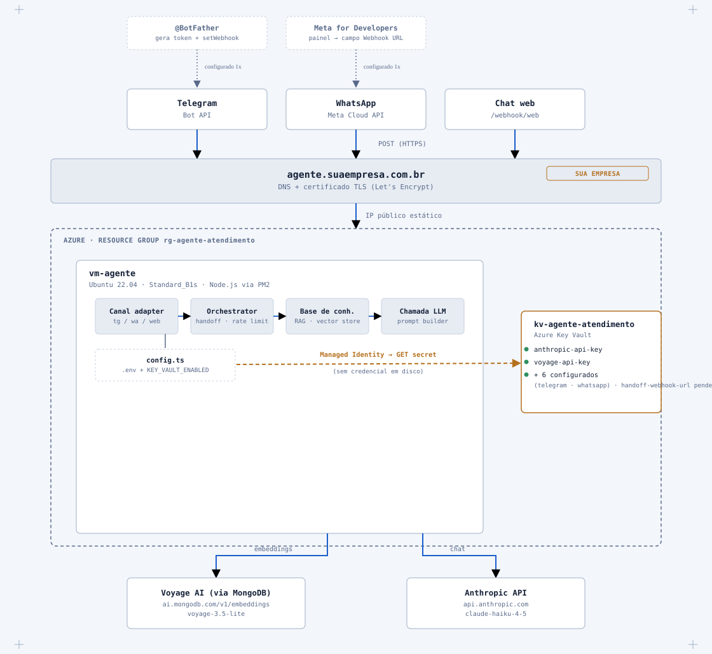
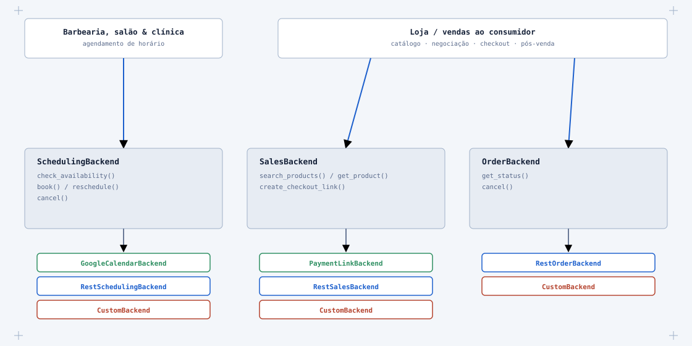
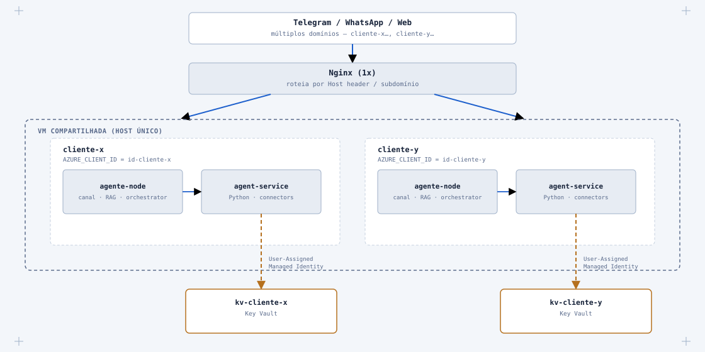
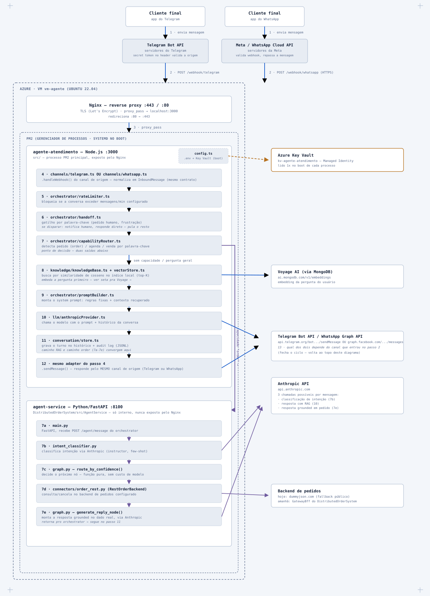

# Status do projeto

Checklist consolidado de tudo que foi feito e do que falta, cobrindo os três
repositórios envolvidos: `ai-customer-service-agent` (este),
`DistributedOrderSystem` (o `AgentService`, Python) e `rizzatotech-site` (site
institucional). Para os passos manuais de domínio/email/WhatsApp, ver
[`GO_LIVE_CHECKLIST.md`](GO_LIVE_CHECKLIST.md).

Última atualização: 04/10/2026.

---

## Feito

### Site institucional (`rizzatotech-site`)

- [x] Domínio `rizzatotech.com` registrado (Hostinger) + email `contato@rizzatotech.com` (DKIM ativo)
- [x] Site Next.js + Tailwind v4 (export estático) — [repo](https://github.com/andre-rizzato/rizzatotech-site), [www.rizzatotech.com](https://www.rizzatotech.com)
- [x] Implantado em Azure Static Web Apps (`rg-rizzatotech-site`, plano gratuito), deploy automático via GitHub Actions a cada push
- [x] Domínio customizado + certificado TLS próprio ativos
- [ ] Login é só interface — sem autenticação/backend real ainda (deliberado, ver README do repo)

### Infraestrutura Azure (ambiente de teste)

- [x] Resource group `rg-agente-atendimento` (eastus), VM `vm-agente` (Ubuntu 22.04, Standard_B1s)
- [x] Azure Key Vault `kv-agente-atendimento` (RBAC) — segredos nunca em texto plano em nenhum dos dois serviços
- [x] Managed Identity (system-assigned) na VM, com role `Key Vault Secrets User`
- [x] `src/config.ts` (Node) e `config.py` (`AgentService`) buscam segredos do Key Vault via `DefaultAzureCredential` quando `KEY_VAULT_ENABLED=true`, com fallback idêntico ao `.env` local quando `false`
- [x] 1GB de swap configurado na VM (`/etc/fstab`) — ver incidente abaixo

### Agente de atendimento (Node)

- [x] Deploy completo na VM via PM2 + systemd (sobrevive a reboot)
- [x] Bug do endpoint da Voyage corrigido (`ai.mongodb.com`, não `api.voyageai.com`) e chave rotacionada
- [x] Pipeline RAG + LLM + handoff validado de ponta a ponta
- [x] Nginx + certificado Let's Encrypt (Certbot) na VM — `rizzato-tech.rizzatotech.com`, HTTPS com renovação automática
- [x] `businessName` do tenant de teste atualizado pra "Rizzato Systems"

### Canais

- [x] **Telegram** — bot `@rizzatotech_atendimento_bot`, webhook registrado, **mensagem real testada em produção** (resposta do RAG recebida no app)
- [x] **WhatsApp** — conta no Meta for Developers criada, número de teste liberado, webhook registrado e verificado (GET de verificação confirmado no log do Nginx)
- [ ] **WhatsApp — envio bloqueado**: número de teste do Meta é `+1` (EUA); regra antifraude barra `+1 → +55` (erro 130497, descasamento de país — não é verificação de negócio/CNPJ). Correção planejada: registrar chip `+55` na API em nuvem (semana de 11/10/2026) — ver `GO_LIVE_CHECKLIST.md` passo 4 pros cuidados (chip sai do WhatsApp normal, guardar o PIN de 6 dígitos)

### Arquitetura de capacidades

- [x] Interfaces `OrderBackend` / `SchedulingBackend` / `CatalogBackend` / `CheckoutBackend` (`DistributedOrderSystem/src/AgentService/connectors/`)
- [x] `RestOrderBackend` e `RestCatalogBackend` — genéricos, configuráveis por cliente via env var
- [x] `GoogleCalendarBackend` — implementado (slot-picking com cobertura de teste, sem rede)
- [x] `StripeCheckoutBackend` — implementado contra a API estável da Stripe
- [x] `PagSeguroCheckoutBackend` — implementado, **payload não verificado contra conta real** (ver `connectors/README.md`)
- [x] `capabilityRouter.ts` + `agentServiceClient.ts` (Node) — roteia pergunta de pedido pro `AgentService` antes do RAG, com fallback pra handoff em caso de falha
- [x] `enabledCapabilities` por cliente em `agent.config.json` (gate de `order`/`scheduling`/`sales`)
- [x] `AgentService` implantado na VM, rodando em paralelo ao agente Node
- [x] Fallback público (`dummyjson.com/carts`) configurado enquanto o `GatewayBff` não está acessível da VM

### Revisão de segurança (04/10/2026)

- [x] Deduplicação de mensagem por id (`wamid`/`update_id`) nos dois canais
- [x] Validação de assinatura HMAC-SHA256 em cada webhook do WhatsApp (`X-Hub-Signature-256`)
- [x] Cancelamento de pedido é sempre handoff humano — agente nunca cancela sozinho (duas camadas: Node e `AgentService`)
- [x] Groundwork de verificação de identidade pra consulta de status (`requester_phone` trafegando ponta a ponta) — comparação real ainda não implementada em nenhum conector genérico
- [x] Bot fica em silêncio total depois de um handoff (`HandoffStateStore`, persistido em disco), com liberação manual (`scripts/releaseHandoff.ts`) e timeout de segurança (4h, configurável)
- [x] `agent-service` na VM mudado de `--host 0.0.0.0` pra `127.0.0.1` — porta 8100 não é mais alcançável de fora da VM
- [x] Regra anti-alucinação de status de pedido no system prompt (RAG nunca inventa status)
- [x] **Incidente resolvido no deploy**: a nova checagem cruzada de `WHATSAPP_APP_SECRET` (item #3) derrubou o `agente-atendimento` na VM em crash-loop — o secret nunca tinha sido criado no Key Vault, porque não existia antes desta revisão. Corrigido adicionando `whatsapp-app-secret` em `kv-agente-atendimento` e reiniciando o processo; confirmado estável (sem mais restarts) e com os 3 canais montados. Lição: uma checagem fail-fast nova que depende de um secret precisa do secret já existir no Key Vault ANTES do deploy que introduz a checagem, não depois.
- Detalhe completo dos 8 pontos revisados, o que foi corrigido e o que ficou pendente: [`SECURITY_REVIEW.md`](SECURITY_REVIEW.md)

### Relay de handoff pelo Telegram (05/10/2026 — Opção B do item #5)

Guia completo: [`HANDOFF_RELAY.md`](HANDOFF_RELAY.md).

- [x] `handoffNotifier: "telegram"`: alerta com histórico no chat do atendente com o bot (`HANDOFF_TELEGRAM_CHAT_IDS`), terminando com `🆔 <conversationId>`
- [x] Caminho principal: atendente dá **Responder** (reply) no alerta, ou em qualquer mensagem do bot com 🆔, e o texto vai pro cliente no canal original (`src/handoff/telegramDesk.ts` → `src/handoff/relay.ts`)
- [x] Mensagens novas do cliente durante o handoff são repassadas ao atendente (`onCustomerMessage`)
- [x] Mini App (`public/handoff-app.html`, botão "💬 Abrir conversa"): histórico completo + resposta + devolver ao bot, autenticado pelo `initData` assinado do Telegram (exige `PUBLIC_BASE_URL` https)
- [x] Botão "🤖 Devolver ao bot" e `/liberar`, além do `scripts/releaseHandoff.ts`; resposta do atendente renova o timeout de 4h
- [x] Widget web recebe a resposta por polling (`GET /webhook/web/poll`, só durante o handoff); `sessionId` agora é `crypto.randomUUID()` persistido por aba; `formatMessage` escapa HTML (era XSS)
- [x] `GET /webhook/web/health` criado — o widget mostrava "Offline" sempre porque essa rota não existia
- [x] Boot recusa `HANDOFF_TELEGRAM_CHAT_IDS` sem `TELEGRAM_WEBHOOK_SECRET` (senão dava pra forjar uma resposta de atendente pelo webhook)
- [ ] Deploy: definir `HANDOFF_TELEGRAM_CHAT_IDS` e `PUBLIC_BASE_URL` no `.env` da VM (não estão no Key Vault, não são segredo), conferir que `TELEGRAM_WEBHOOK_SECRET` já existe lá e mudar o `handoffNotifier` para `telegram` pela tela de configuração
- [x] Deploy do widget atualizado no `rizzatotech-site` (cópia vendorizada; o original no `DistributedOrderSystem` não foi alterado)

### Tela de configuração fechada para a internet (05/10/2026)

Tutorial de uso (túnel, fluxo do save, desfazer): [`TUTORIAL_CONFIGURACAO.md`](TUTORIAL_CONFIGURACAO.md). `settings.html` e `/api/config` estavam abertos pra internet em produção, sem login.

- [x] `/settings.html` e `/api/config` bloqueados no Nginx da VM (404, regex case-insensitive — o Express casa rotas sem diferenciar maiúsculas); acesso só por túnel SSH (`ssh -L 3000:localhost:3000 azureuser@20.127.12.103`)
- [x] Auditoria do access log: nenhum acesso de terceiros com sucesso (só um scanner em 04/10, que recebeu 404 porque a tela ainda não existia)
- [ ] Acesso pela internet com login de admin (Firebase, mesmo do site) — em desenvolvimento, fora deste commit; o projeto Firebase do site também ainda não está configurado

### Encerramento de atendimento humano (05/10/2026)

- [x] Botão **✅ Encerrar atendimento** no alerta do Telegram e no Mini App, mais o comando `/encerrar`: aviso ao cliente + devolve ao bot (diferente de "Devolver ao bot", que não avisa)
- [x] Encerramento automático por inatividade (`handoffInactivityMinutes`, padrão 30, 0 desliga; campo na tela de configuração): varredura a cada minuto, aviso ao cliente e ao atendente
- [x] Widget e simulador mostram o aviso automático sem o rótulo "Atendente" (`fromHuman` no polling)
- [ ] Deploy (push) — commitado, ainda não enviado à VM

### CI/CD

- [x] `deploy.yml` (Node) e `deploy-agent-service.yml` (`AgentService`) — GitHub Actions, deploy automático no push
- [x] Chave SSH dedicada só pra CI (não a pessoal), restrita (`no-port-forwarding,no-X11-forwarding,no-agent-forwarding`)
- [x] **Incidente resolvido**: `npm ci`/`pip install` rodando junto com os dois serviços já ativos travou a VM (B1s, sem swap) a ponto de não responder nem o SSH — corrigido com swap + os workflows agora param os dois serviços antes de instalar. Validado com deploy real depois da correção (56s, sucesso).

### Documentação e artefatos

- [x] [`Blueprint do Agente`](artifacts/blueprint-do-agente.html) — arquitetura de deploy, fluxo de mensagem, Key Vault
- [x] [`Mapa de Capacidades`](artifacts/mapa-capacidades.html) — capacidades plugáveis, decisões de pagamento/implantação/roteamento
- [x] [`Fluxo da Requisição`](artifacts/fluxo-da-requisicao.html) — Nginx/PM2/serviços, módulo por módulo, do webhook do WhatsApp até a resposta
- [x] [`Widget Embarcável`](artifacts/widget-embarcavel.html) — decisão de unificar o widget de chat do DistributedOrderSystem sob o Node Orchestrator (um cérebro, duas mãos); fases 1 a 4 já executadas
- [x] [`SSH_LINUX_GUIDE.pdf`](SSH_LINUX_GUIDE.pdf) — conectar na VM, comandos essenciais, receitas da rotina real do projeto
- [x] Diagramas exportados como SVG standalone em `artifacts/images/` (abaixo)
- [x] `GO_LIVE_CHECKLIST.md` — passos de domínio/email/DNS/Meta Developers + plano de teste com 2 tenants

---

## Pendente

### Manual — só você consegue fazer (ver [`GO_LIVE_CHECKLIST.md`](GO_LIVE_CHECKLIST.md))

- [x] ~~Domínio, site mínimo, email corporativo~~ — feito, ver seção acima
- [x] ~~DNS + HTTPS do tenant de teste~~ — `rizzato-tech.rizzatotech.com`, feito
- [x] ~~Conta no Meta for Developers + número de teste do WhatsApp~~ — feito
- [x] ~~Webhook registrado~~ — Telegram testado com mensagem real; WhatsApp verificado, envio pendente do chip `+55`
- [ ] Chip `+55` registrado na API do WhatsApp (planejado semana de 11/10/2026)
- [ ] DNS + teste via canal real pro tenant `DistributedOrderSystem` (só validado via `/webhook/web` até agora)
- [ ] Catálogo real do negócio (hoje ainda é `catalog.example.json`)

### Técnico — segurança (ver `SECURITY_REVIEW.md`)

- [ ] Pergunta de verificação (fallback de identidade pra canais sem telefone confiável, ex. Telegram) — desenho ainda não feito (item #4)
- [x] ~~Mecanismo de relay em tempo real pro atendente humano (Opção B do item #5)~~ — feito em 05/10/2026 pelo Telegram, ver seção "Relay de handoff" acima
- [ ] LGPD pro vertical de clínica (dado de saúde) — checklist jurídico/técnico em aberto (item #8), não bloqueia o vertical testado hoje

### Técnico — capacidades

- [ ] `scheduling`/`sales`: detectadas pelo `capabilityRouter` mas sem nó de grafo real no `AgentService` ainda — hoje caem em handoff (comportamento correto, honesto, mas não é a capacidade funcionando de fato)
- [ ] `GoogleCalendarBackend` nunca testado contra uma conta Google real (sem service account disponível nesta sessão)
- [ ] `PagSeguroCheckoutBackend`: verificar endpoint/payload contra a doc atual (dev.pagbank.com.br) antes de produção
- [ ] `GatewayBff` do `DistributedOrderSystem` só roda local — capacidade `order` em produção de verdade depende disso (ou de outro backend real) existir em algum lugar acessível

### Técnico — widget embarcável

- [ ] Fase 5 do [`Widget Embarcável`](artifacts/widget-embarcavel.html): provisionar o par container+UAMI+KV por cliente quando houver 1º cliente pagante do gadget (fases 1–4 já concluídas)

### Técnico — infraestrutura

- [ ] VM `Standard_B1s` é pequena — o swap resolveu o travamento, mas vale considerar upgrade (B2s) se a carga crescer
- [ ] Hardening do `AgentService`: retry/timeout nas chamadas HTTP, log estruturado, `/health` checando dependências reais (hoje só confirma que o processo subiu)
- [ ] Modelo multi-tenant (container por cliente + User-Assigned Managed Identity + Key Vault por cliente) — **desenhado, não provisionado**. Só faz sentido quando houver um segundo cliente real.
- [ ] Ambientes de staging/produção — **deliberadamente adiado** pro primeiro cliente real, não é trabalho de agora

### Fora de escopo por enquanto (decisão já tomada)

- RAG avançado (hybrid search, reranking, Qdrant, RAGAS, DSPy) e fine-tuning (LoRA/QLoRA, DPO, vLLM) — fica pro `DistributedOrderSystem`/curso, só migra pro produto quando o volume real justificar
- `npm audit` acusa vulnerabilidades em `@xenova/transformers` (dependência opcional, embeddings locais não usados) — pré-existente, não introduzido nesta sessão
