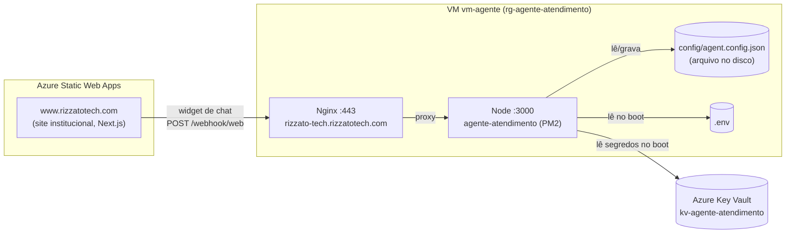
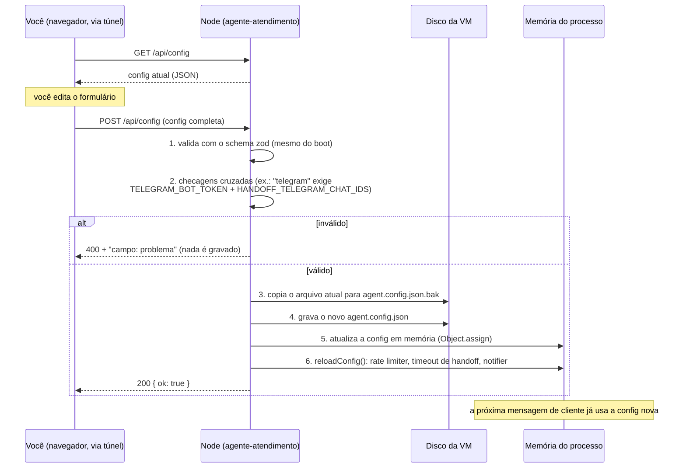

# Tutorial: acessar e atualizar a configuração do agente

Guia prático de **como mexer na configuração do bot em produção** depois das
mudanças de 05/10/2026: a tela de configuração saiu da internet e passou a ser
acessada por túnel SSH, e ganhou o campo de encerramento de atendimento por
inatividade. Também explica, passo a passo, o que acontece quando você clica
em **Salvar**.

Última atualização: 05/10/2026 (horário da VM: 06/10 UTC).

---

## 0. Primeiro, a pergunta mais comum: o site atualiza a configuração?

**Não.** O site institucional e a configuração do bot não têm ligação
nenhuma. São três coisas separadas:



- **O site** só embute o widget de chat, que conversa com o bot. Ele não lê
  nem grava configuração nenhuma.
- **A configuração de negócio** (nome, tom, palavras de handoff, temperatura,
  notificação, tempos de encerramento...) é um **arquivo JSON no disco da VM**:
  `/home/azureuser/agente-atendimento/config/agent.config.json`. O caminho vem
  de `AGENT_CONFIG_PATH=./config/agent.config.json` no `.env`.
- **A tela de configuração** (`settings.html`) é servida pelo próprio agente,
  na VM. Salvar nela grava esse arquivo.
- **Segredos** (tokens do Telegram/WhatsApp, chaves de API) **não passam pela
  tela**: ficam no Key Vault e são lidos só no boot.
- **Nenhum recurso do Azure é alterado** ao salvar: nem VM, nem Key Vault, nem
  `.env`. É só um arquivo JSON.

---

## 1. O que mudou em 05/10/2026 (resumo)

| Antes | Agora |
|---|---|
| `https://rizzato-tech.rizzatotech.com/settings.html` aberto pra qualquer pessoa, sem login | bloqueado no Nginx (404 de fora); acesso só por **túnel SSH** |
| `POST /api/config` aceitava qualquer um | bloqueado de fora (mesma regra do Nginx) |
| Atendimento humano só terminava com `/liberar` ou depois de 4h | botão **✅ Encerrar atendimento** + **encerramento automático por inatividade** |
| Um timer de handoff (4h) | dois timers: inatividade (minutos, avisa o cliente) e atendente ausente (horas, silencioso) |

Detalhes técnicos do atendimento humano: [`HANDOFF_RELAY.md`](HANDOFF_RELAY.md).

**Onde está o bloqueio:** `/etc/nginx/snippets/agente-admin-block.conf` na VM,
incluído no server block de `rizzato-tech.rizzatotech.com` (backup do arquivo
original: `/etc/nginx/sites-available/rizzato-tech.rizzatotech.com.bak-2026-10-05`).
Ele devolve 404 para `/settings.html`, `/api/config` e `/api/auth/config`, com
regex **case-insensitive**, porque o Express casa rotas sem diferenciar
maiúsculas (`/API/CONFIG` também chegaria no handler). A porta 3000 do Node
está fechada no firewall (NSG) do Azure, então não há como contornar o Nginx.

---

## 2. Tutorial: abrir a tela de configuração (túnel SSH)

O túnel faz a porta 3000 do **seu computador** apontar para a porta 3000 **da
VM**, por dentro da conexão SSH. O navegador fala direto com o Node, sem passar
pelo Nginx, então o bloqueio não se aplica a você.

**Passo 1.** Abra um terminal (Git Bash ou PowerShell) e rode:

```bash
ssh -L 3000:localhost:3000 azureuser@20.127.12.103
```

Use a mesma chave SSH de sempre. Deixe essa janela **aberta**: o túnel só
existe enquanto a sessão SSH estiver conectada.

**Passo 2.** No navegador, abra:

```
http://localhost:3000/settings.html
```

**Passo 3.** Altere o que quiser e clique em **Salvar configurações** (a
barra aparece no rodapé quando há mudança). A mensagem *"✓ Configurações
salvas — já valem na próxima mensagem"* confirma.

**Passo 4.** Feche o túnel com `exit` (ou fechando a janela do terminal).

> **Se você estiver rodando o projeto local** (`npm run dev`) a porta 3000 do
> seu computador já está ocupada, e o túnel falha (ou você acaba abrindo a
> config **local** sem perceber). Use outra porta local:
>
> ```bash
> ssh -L 3001:localhost:3000 azureuser@20.127.12.103
> # -> http://localhost:3001/settings.html
> ```
>
> Confira sempre o endereço: `localhost:3001` (túnel) é produção;
> `localhost:3000` com `npm run dev` rodando é a sua máquina.

### Como saber se está tudo certo

| Teste | Esperado |
|---|---|
| `https://rizzato-tech.rizzatotech.com/settings.html` (sem túnel) | **404**: bloqueio funcionando |
| `http://localhost:3000/settings.html` (com túnel) | a tela carrega com a config de produção |
| `https://rizzato-tech.rizzatotech.com/webhook/web/health` | `{"ok":true}`: o bot está no ar |

---

## 3. O fluxo de uma atualização: o que acontece ao clicar em Salvar



Passo a passo, em palavras:

1. **Validação.** O payload passa pelo mesmo schema que valida o arquivo no
   boot (`AgentConfigSchema` em `src/config.ts`). Um valor fora do permitido
   (ex.: `temperature` 1.5) volta como erro na própria tela, e nada é gravado.
2. **Checagens cruzadas.** Algumas opções dependem do `.env`. Ex.: escolher a
   notificação **Telegram** sem `TELEGRAM_BOT_TOKEN` e
   `HANDOFF_TELEGRAM_CHAT_IDS` é recusado. Isso impede deixar o bot num estado
   em que o cliente ouve "vou te conectar com um atendente" e ninguém é avisado.
3. **Backup.** O arquivo atual vira `agent.config.json.bak`, que guarda só a
   **versão imediatamente anterior** (o save seguinte sobrescreve o `.bak`).
4. **Gravação.** O arquivo novo é escrito no disco.
5. **Memória.** A config do processo é atualizada no lugar. Os módulos que leem
   a config a cada mensagem (prompt, palavras-chave, RAG) já veem o valor novo.
6. **Recarga.** As três peças que guardam valores ao iniciar são recalculadas:
   limites do rate limiter, timeout de handoff e o tipo de notificação.
   **Não precisa reiniciar o processo.**

### O que o save NÃO faz

- Não toca no `.env`, no Key Vault, nem em nenhum recurso do Azure.
- Não reinicia o PM2.
- Não é desfeito por um **deploy**: o deploy automático (GitHub Actions, a
  cada push no `master`) **exclui** `config/agent.config.json` e `.env` da
  cópia. A config de produção só muda pela tela ou editando o arquivo na VM.

### Desfazer uma mudança

Pela VM (só existe a versão imediatamente anterior):

```bash
cd ~/agente-atendimento/config
cp agent.config.json.bak agent.config.json
pm2 restart agente-atendimento --update-env
```

Aqui o restart **é** necessário: editar o arquivo direto não passa pelo passo 5.

### Editar sem a tela

```bash
ssh azureuser@20.127.12.103
nano ~/agente-atendimento/config/agent.config.json
pm2 restart agente-atendimento --update-env
pm2 logs agente-atendimento --lines 20   # confira que subiu sem erro de validação
```

Se o JSON ficar inválido, o processo **não sobe** (a validação do boot recusa).
O log diz qual campo está errado. Corrija ou restaure o `.bak`.

---

## 4. Tutorial: configurar o atendimento humano

Estado em produção (06/10 UTC): a notificação já está em **Telegram**,
`HANDOFF_TELEGRAM_CHAT_IDS` e `PUBLIC_BASE_URL` estão no `.env`, e o log
confirma `Handoff relay: 1 atendente(s) no Telegram.`

### 4.1 Os dois tempos (card "🤝 Transferência para humano")

| Campo na tela | Chave no JSON | Padrão | O que faz |
|---|---|---|---|
| Liberar sozinho após (horas) | `handoffTimeoutHours` | 4 | sem resposta **do atendente** por esse tempo, o bot volta **em silêncio** |
| Encerrar por inatividade após (minutos) | `handoffInactivityMinutes` | 30 | sem **nenhuma** mensagem (cliente ou atendente), o atendimento é **encerrado com aviso** ao cliente e ao atendente. 0 desliga |

> O campo de inatividade (e os botões de encerrar abaixo) só existem na VM
> **depois do próximo push** (o código está commitado, ainda não enviado). No
> primeiro boot com o código novo, vale o padrão de 30 min até alguém mudar.

### 4.2 Como o atendente encerra (no Telegram)

No alerta de handoff há três botões:

| Botão | Efeito |
|---|---|
| 💬 Abrir conversa | abre o Mini App com o histórico completo |
| ✅ Encerrar atendimento | o cliente recebe *"Atendimento encerrado. Obrigado pelo contato!..."* e o bot volta a responder |
| 🤖 Devolver ao bot | o bot volta a responder, **sem** aviso ao cliente |

Os mesmos comandos funcionam como **resposta (reply)** a qualquer mensagem do
bot com `🆔`: `/encerrar` e `/liberar`. No Mini App há os botões
**✅ Encerrar** e **🤖 Devolver ao bot**.

Quando o encerramento é por **inatividade**, o atendente recebe:
`🔚 Atendimento encerrado por inatividade (cliente no widget do site).`

---

## 5. Próxima etapa: acesso pela internet com login de admin

O túnel é a solução **provisória**. O plano é abrir a tela de novo pela
internet, mas com login de admin usando o mesmo Firebase Authentication do
site institucional (mesmas contas, "Entrar com Google"). Esse trabalho está em
desenvolvimento e **não faz parte deste commit**. Ele depende de um projeto
Firebase que ainda não existe: o login do próprio site também não está ligado
em produção (os secrets `NEXT_PUBLIC_FIREBASE_*` não estão no GitHub do
`rizzatotech-site`).

**Até lá, não remova o bloqueio do Nginx**: sem ele, a tela volta a ficar
aberta pra qualquer pessoa, sem login.

---

## 6. Problemas comuns

| Sintoma | Causa provável | Solução |
|---|---|---|
| `bind [127.0.0.1]:3000: Address already in use` ao abrir o túnel | `npm run dev` local ocupando a porta | `ssh -L 3001:localhost:3000 ...` e use `localhost:3001` |
| A tela abre mas mostra a config "Sua Empresa" | você abriu a config **local**, não a de produção | feche o `npm run dev` ou use a porta 3001 no túnel |
| Salvar dá erro `handoffNotifier=telegram mas ...` | falta variável no `.env` da VM | adicione, `pm2 restart agente-atendimento --update-env`, salve de novo |
| `https://.../settings.html` abre de fora | bloqueio do Nginx removido | restaurar `include snippets/agente-admin-block.conf;` no server block (seção 1) e `sudo nginx -t && sudo systemctl reload nginx` |
| O bot não sobe depois de editar o JSON na mão | JSON ou valor inválido | `pm2 logs agente-atendimento`; corrigir ou restaurar `agent.config.json.bak` |

---

## 7. Registro do que foi feito (05/10/2026, horário da VM 06/10 UTC)

1. **00:23 UTC**: notificação de handoff trocada para **Telegram** pela tela
   (feita por você, antes do bloqueio). O `.bak` tem a versão anterior
   (`console`).
2. **01:07 UTC**: bloqueio no Nginx aplicado e verificado
   (`/etc/nginx/snippets/agente-admin-block.conf`, backup
   `rizzato-tech.rizzatotech.com.bak-2026-10-05`).
3. **Commitado, sem push** (só chega na VM no próximo push):
   - botão/comando de encerramento e encerramento por inatividade
     (`src/handoff/relay.ts`, `telegramDesk.ts`, `telegramNotifier.ts`,
     `handoffState.ts`, Mini App);
   - aviso de encerramento no widget sem o rótulo "Atendente"
     (`rizzatotech-site`).
4. **Auditoria dos logs do Nginx** (todos os arquivos, incluindo os
   rotacionados): os acessos a `/settings.html` e `/api/config` que
   **funcionaram** (200) vieram todos do seu próprio IP: os testes e o save
   acima. O único outro IP foi um **scanner automático em 04/10 14:21 UTC**, que
   procurou `/.env`, `/config.json`, `/api/config`, `/CLAUDE.md`,
   `/AGENTS.md` e outros, e recebeu 404 em tudo, porque a tela de configuração
   ainda não existia no servidor naquela data. Ou seja, não houve exposição,
   mas fica a prova de que robôs procuram exatamente `/api/config` (motivo a
   mais pro bloqueio).
