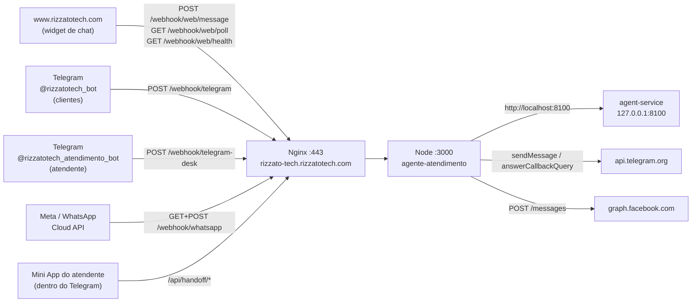

# Webhooks e URLs do sistema

Referência única de **todos os endereços** que o sistema usa: quem chama cada
um, como cada chamada é autenticada, para onde aponta cada webhook do Telegram
e do WhatsApp, e **os comandos exatos** usados para registrar os webhooks do
Telegram (com os tokens lidos do Key Vault, sem aparecer na tela).

Valores conferidos na VM, no Key Vault e na API do Telegram em 06/10/2026.

Última atualização: 07/10/2026 (contrato interno `/agent/message`, seção 2).

---

## 1. Visão geral



- **Domínio público do agente:** `https://rizzato-tech.rizzatotech.com`. Nginx
  na VM (`vm-agente`, IP `20.127.12.103`), certificado Let's Encrypt (renovação
  automática), repassa tudo para o Node em `localhost:3000`.
- **Site institucional:** `https://www.rizzatotech.com` (Azure Static Web
  Apps). `https://rizzatotech.com` redireciona para o `www` (Nginx da VM,
  bloco `rizzatotech-raiz`).
- **Firewall do Azure (NSG `vm-agenteNSG`):** só 22, 80 e 443 abertas. A
  porta 3000 (Node) e a 8100 (agent-service) não são alcançáveis de fora.

---

## 2. Todas as rotas públicas

Todas sob `https://rizzato-tech.rizzatotech.com`. Código: `src/server.ts`.

### Canais (webhooks)

| Rota | Método | Quem chama | Autenticação | Para quê |
|---|---|---|---|---|
| `/webhook/telegram` | POST | Telegram, bot de **clientes** `@rizzatotech_bot` | header `X-Telegram-Bot-Api-Secret-Token` = `telegram-webhook-secret` (401 sem ele) | mensagens de clientes → LLM / handoff |
| `/webhook/telegram-desk` | POST | Telegram, bot **do atendente** `@rizzatotech_atendimento_bot` | mesmo header (vale `HANDOFF_TELEGRAM_WEBHOOK_SECRET` ou, sem ele, `telegram-webhook-secret`) | replies do atendente, botões "Encerrar"/"Devolver", `/encerrar`, `/liberar`, `/meuid` |
| `/webhook/whatsapp` | GET | Meta (uma vez, ao registrar) | `hub.verify_token` = `whatsapp-verify-token` (403 se errado) | handshake de verificação |
| `/webhook/whatsapp` | POST | Meta (cada mensagem) | assinatura HMAC `X-Hub-Signature-256` com `whatsapp-app-secret` (401 se inválida) | mensagens de clientes do WhatsApp |
| `/webhook/web` e `/webhook/web/message` | POST | widget do site, `whatsapp.html` | nenhuma (público por natureza) + CORS só para `WIDGET_ALLOWED_ORIGINS` + rate limit | mensagens do canal web. `/message` é alias porque o widget sempre acrescenta esse sufixo |
| `/webhook/web/poll` | GET | widget, `whatsapp.html` (a cada 4s **só durante handoff**) | o `sessionId` é a chave (UUID aleatório); devolve só falas do atendente e avisos | respostas do atendente para o canal web |
| `/webhook/web/health` | GET | widget (status Online/Offline) | nenhuma | saúde, com CORS |

### Atendente (Mini App)

| Rota | Método | Autenticação | Para quê |
|---|---|---|---|
| `/handoff-app.html?c=<conversationId>` | GET | nenhuma (a página em si não tem dados) | Mini App, aberto pelo botão "💬 Abrir conversa" do alerta |
| `/api/handoff/:id` | GET | header `X-Telegram-Init-Data`, assinado pelo **bot do atendente** + allowlist `HANDOFF_TELEGRAM_CHAT_IDS` | histórico + estado |
| `/api/handoff/:id/reply` | POST | idem | responder ao cliente |
| `/api/handoff/:id/release` | POST | idem | devolver ao bot |
| `/api/handoff/:id/close` | POST | idem | encerrar o atendimento |

### Outras

| Rota | Situação |
|---|---|
| `/health` | pública: `{"ok":true}` |
| `/whatsapp.html` | pública: simulador de chat que fala com o canal web |
| `/settings.html`, `/api/config`, `/api/auth/config` | **bloqueadas no Nginx** (404 de fora, regex case-insensitive). Acesso só por túnel SSH: ver [`TUTORIAL_CONFIGURACAO.md`](TUTORIAL_CONFIGURACAO.md) |

### Internas (não expostas)

| Endereço | Quem usa |
|---|---|
| `http://localhost:3000` | Nginx → Node |
| `http://localhost:8100` (`AGENT_SERVICE_URL`) | Node → agent-service (uvicorn `--host 127.0.0.1 --port 8100`) |

**`POST /agent/message` (Node → agent-service), corpo:** `message`,
`session_id`, `requester_phone` (só WhatsApp; `null`/ausente no Telegram,
que não tem telefone verificado) e, desde 07/10/2026, `language`
(`"pt"`/`"en"`/`"it"`, o mesmo idioma já resolvido pelo canal — ver
`src/orchestrator/messages.ts`; ausente nos canais que hoje não informam
idioma, como o WhatsApp). Faltava esse campo: o agent-service respondia
sempre em inglês (prompt fixo em `graph.py`), mesmo pra cliente que
escreveu em português — bug corrigido junto com esta mudança (ver
`AgentService/graph.py` e `AgentService/messages.py`, repo
`DistributedOrderSystem`). Resposta (`AgentResponse`) não mudou: `reply`,
`intent`, `confidence`, `order_id`.

---

## 3. Webhooks do Telegram: estado atual

| Bot | Papel | Segredo do token no Key Vault | Webhook registrado |
|---|---|---|---|
| `@rizzatotech_bot` | **clientes** (simula o futuro WhatsApp) | `telegram-bot-token` | `https://rizzato-tech.rizzatotech.com/webhook/telegram` |
| `@rizzatotech_atendimento_bot` | **atendente** (alertas, Responder, Mini App) | `handoff-telegram-bot-token` | `https://rizzato-tech.rizzatotech.com/webhook/telegram-desk` |

Os dois usam o mesmo segredo de webhook (`telegram-webhook-secret`), sem
`allowed_updates` (o padrão do Telegram inclui mensagens **e** cliques em
botão, que os botões do alerta precisam). Conferido com `getWebhookInfo` em
06/10/2026: URL certa, `ip_address` = `20.127.12.103`, sem erro, 0 pendentes.

**Histórico:**

- 04/10: um bot só, `@rizzatotech_atendimento_bot`, em `/webhook/telegram`.
- 06/10 (~03:15 UTC): separado em dois bots (migração em
  [`HANDOFF_RELAY.md`](HANDOFF_RELAY.md), seção 4.1). Entre gravar o token novo
  e registrar o webhook dele, o `@rizzatotech_bot` ficou sem webhook e não
  respondia nem ao `/start`.

---

## 4. Como os webhooks do Telegram foram registrados (comandos exatos)

Rodados no terminal local (Git Bash), com `az login` feito. **Os tokens nunca
aparecem na tela nem no histórico do chat**: são lidos do Key Vault para
variáveis do shell.

```bash
KV=kv-agente-atendimento
URL=https://rizzato-tech.rizzatotech.com

# 1. Ler os tokens e o segredo do Key Vault (sem imprimir)
DESK=$(az keyvault secret show --vault-name $KV -n handoff-telegram-bot-token --query value -o tsv)
CUST=$(az keyvault secret show --vault-name $KV -n telegram-bot-token --query value -o tsv)
SEC=$(az keyvault secret show --vault-name $KV -n telegram-webhook-secret --query value -o tsv)

# 2. SEMPRE conferir de quem é cada token ANTES do setWebhook.
#    Trocar os dois apontaria o bot de clientes pro balcão e vice-versa.
curl -s "https://api.telegram.org/bot$DESK/getMe"   # tem que ser rizzatotech_atendimento_bot
curl -s "https://api.telegram.org/bot$CUST/getMe"   # tem que ser rizzatotech_bot

# 3. Registrar os webhooks
curl -s "https://api.telegram.org/bot$DESK/setWebhook" \
  -d "url=$URL/webhook/telegram-desk" -d "secret_token=$SEC"
curl -s "https://api.telegram.org/bot$CUST/setWebhook" \
  -d "url=$URL/webhook/telegram" -d "secret_token=$SEC"
# resposta esperada de cada um: {"ok":true,"result":true,"description":"Webhook was set"}

# 4. Reiniciar o agente pra ele ler os tokens do Key Vault
ssh azureuser@20.127.12.103 'pm2 restart agente-atendimento --update-env'
```

O que cada parâmetro faz:

- `url`: para onde o Telegram faz POST a cada atualização do bot (precisa ser
  HTTPS com certificado válido; o Let's Encrypt da VM serve).
- `secret_token`: o Telegram passa a mandar esse valor no header
  `X-Telegram-Bot-Api-Secret-Token` de **toda** chamada. O servidor recusa
  (401) qualquer POST sem ele. É o que impede alguém de forjar mensagens, e,
  no bot do atendente, de forjar uma resposta "do atendente" para um cliente.
- **Não** passamos `allowed_updates`: se restringir a `["message"]`, os cliques
  nos botões do alerta (`callback_query`) param de chegar.

### Conferir a qualquer momento

```bash
curl -s "https://api.telegram.org/bot$CUST/getWebhookInfo"
curl -s "https://api.telegram.org/bot$DESK/getWebhookInfo"
```

Campos que importam:

| Campo | Esperado | Se não |
|---|---|---|
| `url` | o endereço da tabela da seção 3 | refazer o `setWebhook` |
| `pending_update_count` | 0 (ou baixo) | o servidor não está respondendo: ver `pm2 logs agente-atendimento` |
| `last_error_message` | ausente | `Unauthorized`/401 = segredo diferente do `.env`/Key Vault; `Connection refused`/5xx = app fora do ar |

### Mudar ou desfazer

- **Remover o webhook** de um bot: `curl -s "https://api.telegram.org/bot$TOKEN/deleteWebhook"`.
  As mensagens passam a ficar paradas no Telegram, que guarda até 24h.
- **Voltar a um bot só:** ver "Se algo der errado" em `HANDOFF_RELAY.md` 4.1.
- **Trocar o segredo:** gerar um novo
  (`node -e "console.log(require('crypto').randomBytes(24).toString('hex'))"`),
  gravar em `telegram-webhook-secret` no Key Vault, refazer o `setWebhook` dos
  **dois** bots com o novo `secret_token` e reiniciar o agente. Faça na
  sequência: entre a troca e o restart, as chamadas do Telegram dão 401.

> ⚠️ **Nunca** rode `setWebhook` de um bot de **produção** apontando para a sua
> máquina (ngrok): o Telegram só entrega para um endereço, e o bot sai do ar
> pra todo mundo. Para dev, use bots de dev: [`DEBUG_LOCAL.md`](DEBUG_LOCAL.md),
> seção 8.2.

---

## 5. Webhook do WhatsApp (Meta)

Registrado no painel do Meta for Developers (app → WhatsApp → Configuração),
não por API:

```text
Callback URL:   https://rizzato-tech.rizzatotech.com/webhook/whatsapp
Verify token:   valor do segredo whatsapp-verify-token (Key Vault)
Campo assinado: messages
```

- **Verificação (GET, uma vez):** a Meta chama a URL com `hub.mode=subscribe`,
  `hub.verify_token` e `hub.challenge`. O servidor devolve o `challenge` se o
  token bater (403 se não). Confirmada em 04/10/2026 (log do Nginx, user-agent
  `facebookplatform/1.0`).
- **Mensagens (POST):** cada uma assinada com HMAC-SHA256 do corpo, usando o
  App Secret (`whatsapp-app-secret`). Sem assinatura válida, 401, e nada do
  corpo é processado.
- O `hub.verify_token` aparece no access log do Nginx (a Meta manda na URL). Ele
  só protege o handshake e o log é legível só por root/adm.
- **Estado:** webhook verificado; envio bloqueado até o chip `+55` ser
  registrado (ver `GO_LIVE_CHECKLIST.md`, passo 4).

---

## 6. Widget do site → agente

Em `rizzatotech-site/components/ChatWidget.tsx`:

```ts
chatbotServiceUrl: "https://rizzato-tech.rizzatotech.com/webhook/web"
```

O widget acrescenta os sufixos sozinho: `/message` (enviar), `/poll` (respostas
do atendente) e `/health` (status). O servidor só responde com CORS para as
origens em `WIDGET_ALLOWED_ORIGINS`, hoje `https://www.rizzatotech.com` (no
`.env` da VM). Para embutir o widget em outro domínio, acrescente-o ali
(separado por vírgula) e reinicie o agente.

---

## 7. Onde fica cada valor

| Valor | Onde |
|---|---|
| Tokens dos bots, segredo do webhook do Telegram, credenciais do WhatsApp, chaves de API | Key Vault `kv-agente-atendimento`: `telegram-bot-token`, `handoff-telegram-bot-token`, `telegram-webhook-secret`, `whatsapp-access-token`, `whatsapp-app-secret`, `whatsapp-phone-number-id`, `whatsapp-verify-token`, `anthropic-api-key`, `voyage-api-key` |
| `PUBLIC_BASE_URL`, `WIDGET_ALLOWED_ORIGINS`, `HANDOFF_TELEGRAM_CHAT_IDS`, `AGENT_SERVICE_URL`, `PORT` | `.env` da VM (`/home/azureuser/agente-atendimento/.env`). Não são segredo |
| `chatbotServiceUrl` do widget | `rizzatotech-site/components/ChatWidget.tsx` |
| Bloqueio da tela de configuração | `/etc/nginx/snippets/agente-admin-block.conf` na VM |

A VM lê o Key Vault com a própria identidade (Managed Identity, papel "Key
Vault Secrets User" no cofre inteiro). Segredo novo com nome listado em
`SECRET_ENV_VARS` (`src/config.ts`) é lido no próximo restart, sem mexer em
permissão.
